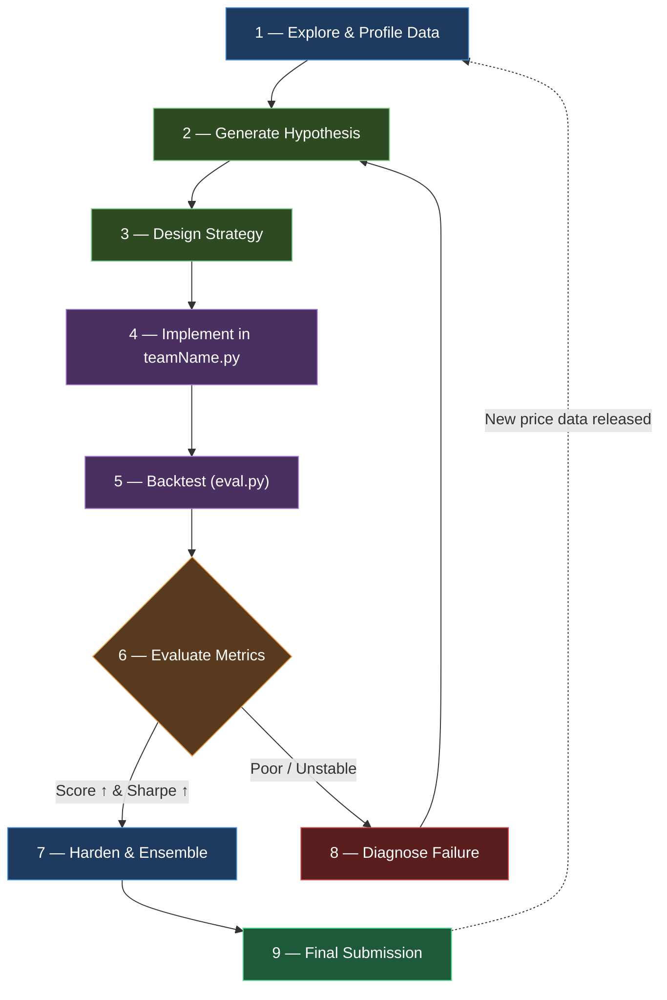

# Strategy Design Loop — Algothon 2026 (CYCLING)

> A structured, iterative framework for developing, testing, and refining
> your `getMyPosition(prcSoFar)` algorithm across 51 instruments × 500 days.

---

## Competition Constraints Cheat-Sheet

| Parameter | Value | Notes |
|:---|:---|:---|
| Instruments | 51 (ALGO + 50 others) | ALGO (idx 0) has special rules |
| Days | 500 (train) + 250 (test) | `eval.py` scores last 250 |
| Position limit | $10,000 per instrument | ALGO: $100,000 |
| Commission | 1 bp (0.01%) | ALGO: 0.2 bp (0.002%) |
| Scoring | `μ × SR² / (SR² + 1)` | Rewards **both** mean PnL and Sharpe |
| Allowed packages | numpy, pandas, scipy, scikit-learn, statsmodels, matplotlib |

> [!IMPORTANT]
> The scoring function penalises volatility heavily. A strategy with `μ = $50, σ = $100`
> (Sharpe ≈ 7.9) scores **$49.2**, but `μ = $100, σ = $500` (Sharpe ≈ 3.16) scores only
> **$71.4**. **Consistency matters more than home-runs.**

---

## The Loop



---

## Phase Details

### 1 — Explore & Profile Data

**Goal:** Understand the statistical properties of the 51-instrument universe before writing any trading logic.

**Checklist:**
- [ ] Plot price series for all 51 instruments — identify trending, mean-reverting, and noisy instruments
- [ ] Compute rolling statistics: mean returns, volatility, skew, kurtosis (windows: 10, 20, 50, 100 days)
- [ ] Build a correlation matrix — identify clusters of correlated / anti-correlated pairs
- [ ] Check for regime changes (structural breaks) — `statsmodels.tsa.stattools.adfuller` for stationarity
- [ ] Profile ALGO (instrument 0) separately — it has 10× position limit and 5× cheaper commissions
- [ ] Check for seasonality, day-of-week effects, or periodic patterns
- [ ] Estimate bid-ask-like spread from consecutive-day returns

**Key questions to answer:**
1. Which instruments are **mean-reverting** (good for contrarian strategies)?
2. Which instruments **trend** (good for momentum)?
3. Are there **lead-lag** relationships between instruments?
4. What is the effective **half-life of mean reversion** per instrument?

```python
# Quick exploration snippet
import numpy as np, pandas as pd

df = pd.read_csv("prices.txt", sep=r"\s+")
log_ret = np.log(df / df.shift(1)).dropna()

# Per-instrument stats
stats = pd.DataFrame({
    "mean_ret":   log_ret.mean(),
    "vol":        log_ret.std(),
    "sharpe":     log_ret.mean() / log_ret.std() * np.sqrt(250),
    "skew":       log_ret.skew(),
    "kurtosis":   log_ret.kurtosis(),
    "autocorr_1": log_ret.apply(lambda x: x.autocorr(1)),
    "autocorr_5": log_ret.apply(lambda x: x.autocorr(5)),
})
print(stats.sort_values("sharpe", ascending=False))
```

---

### 2 — Generate Hypothesis

**Goal:** Form a testable thesis about *why* a strategy should make money.

**Hypothesis template:**

> **"Instrument(s) [X] exhibit [property] over [timeframe],
> which can be exploited by [action] with expected edge of [Y bps/day]."**

**Hypothesis bank** (iterate through these):

| # | Hypothesis | Signal | Instruments |
|:--|:-----------|:-------|:------------|
| H1 | Short-term mean reversion | Negative autocorrelation at lag 1 | Instruments with `autocorr_1 < -0.05` |
| H2 | Momentum / trend-following | Positive returns persist over 5-20 days | Instruments with `autocorr_5 > 0.05` |
| H3 | Cross-sectional mean reversion | Relative outperformers revert | All 51, ranked by recent returns |
| H4 | Pairs / stat-arb | Cointegrated pairs diverge then converge | Correlated pairs (ρ > 0.7) |
| H5 | Volatility-scaled allocation | Allocate more to low-vol instruments | Risk-parity weighting |
| H6 | ALGO as hedge | ALGO's cheap commissions make it ideal for hedging market beta | Instrument 0 vs basket |
| H7 | Regime detection | Different strategies work in different vol regimes | HMM or rolling vol threshold |

> [!TIP]
> Score each hypothesis against the competition scoring function *before* implementing.
> Discard hypotheses where even the best-case μ can't overcome commission drag.

---

### 3 — Design Strategy

**Goal:** Translate the hypothesis into concrete rules *before* touching code.

**Design document template** (fill this out each iteration):

```
Strategy Name:    ___________________________
Hypothesis:       H__ (from bank above)
Signal:           ___________________________
Entry rule:       ___________________________
Exit rule:        ___________________________
Position sizing:  ___________________________ (must respect $10K / $100K limits)
Expected edge:    ___ bps/day
Expected turnover: ___ $/day (commission = turnover × 1bp)
Risk controls:    ___________________________
```

**Design principles:**
1. **Commission-aware sizing:** A strategy that trades $1M/day in notional pays ~$100/day in commissions. Your edge must exceed this.
2. **Position limit awareness:** At current prices, `$10,000 / price` = max shares. Design signals that produce positions within this range.
3. **Look-ahead bias check:** `getMyPosition(prcSoFar)` receives history *up to today*. Never use future data.
4. **State management:** Use `global` variables sparingly. The evaluator calls your function sequentially — you can maintain state across calls.

---

### 4 — Implement in `teamName.py`

**Goal:** Clean, testable implementation of the designed strategy.

**Implementation pattern:**

```python
import numpy as np

nInst = 51
currentPos = np.zeros(nInst)

# ─── Tunable Parameters ───
LOOKBACK = 20          # Signal lookback window
ENTRY_THRESHOLD = 1.5  # Z-score threshold to enter
EXIT_THRESHOLD = 0.5   # Z-score threshold to exit
MAX_DOLLAR_POS = 10000 # Per-instrument $ limit (100000 for inst 0)

def getMyPosition(prcSoFar):
    global currentPos
    nins, nt = prcSoFar.shape

    if nt < LOOKBACK + 1:
        return np.zeros(nins)

    # ─── 1. Compute signal ───
    # ... (strategy-specific logic)

    # ─── 2. Generate target positions (shares) ───
    # ... (convert signal to integer share counts)

    # ─── 3. Apply position limits ───
    pos_limits = np.full(nins, MAX_DOLLAR_POS)
    pos_limits[0] = 100_000
    max_shares = (pos_limits / prcSoFar[:, -1]).astype(int)
    target_pos = np.clip(target_pos, -max_shares, max_shares).astype(int)

    # ─── 4. (Optional) Turnover filter ───
    # Only update if change is meaningful enough to overcome commissions

    currentPos = target_pos
    return currentPos
```

> [!WARNING]
> `eval.py` already clips positions and casts to int — but you should do it yourself to
> avoid unexpected behaviour and to accurately estimate your own PnL during development.

---

### 5 — Backtest (`eval.py`)

**Goal:** Measure performance on the 250-day test window.

```bash
python eval.py
```

**Record every run** in the table below:

| Run | Strategy | Params | Mean PL | Std PL | Sharpe | Score | DolVol | Notes |
|:----|:---------|:-------|--------:|-------:|-------:|------:|-------:|:------|
| 1 | Baseline (starter) | default | 10.4 | 1640.20 | 0.10 | 0.10 | 5,919,621 | High volatility and persistent position accumulation |
| 2 | Multi-horizon time-series reversal | 5d/20d equal blend | 216.4 | 2143.37 | 1.60 | 155.41 | 39,549,924 | Positive in both 125-day halves; last-half Sharpe weakened to 0.96 |
| 3 | Turnover-aware time-series reversal | 5d/20d blend, 20% rebalance band | 221.8 | 2062.66 | 1.70 | 164.75 | 34,602,744 | Turnover down 12.5%; last-half Sharpe improved to 1.14 |
| 4 | Three-horizon reversal (rejected) | Equal 5d/10d/20d blend, 20% band | 222.0 | 2043.52 | 1.72 | 165.76 | 30,639,542 | Test score rose 0.6%, but training score fell about 70% |
| 5 | Volatility risk scaling (rejected) | 20d inverse-vol scale, 50% floor | 199.9 | 1876.90 | 1.68 | 147.82 | 31,735,928 | Lower risk and turnover, but materially lower train and test scores |
| 6 | Reduced ALGO exposure (rejected) | $50K ALGO cap, 20% band | 185.9 | 1831.05 | 1.61 | 133.98 | 31,231,312 | ALGO was profitable and low-risk; halving its cap removed useful edge |
| 7 | Strong-signal gate (rejected) | 30% signal gate, 20% rebalance band | 215.8 | 2024.84 | 1.68 | 159.56 | 35,447,147 | Duplicated existing band protection and increased turnover |
| 8 | Cross-sectional overlay (rejected) | 80% base / 20% market-neutral 5d reversal | 177.1 | 1752.90 | 1.60 | 127.22 | 32,292,577 | Overlay had weak standalone edge and 0.49 test PnL correlation |
| 9 | Slow-weight tilt (rejected) | 33% 5d / 67% 20d, 20% band | 221.9 | 2087.92 | 1.68 | 163.81 | 29,458,415 | Lower turnover and stronger training, but no holdout improvement |
| 10 | Tighter signal clip (rejected) | clip=0.90 / 0.75 / 0.50, band 0.20 | 209.2 | — | 1.74 | 157.28 | 31,747,611 | Best clip (0.90) raised Sharpe but cut official score 4.5%; clip=0.50 hit Sharpe 2.01 at score 114 |
| 11 | Fast lookback 3d (rejected) | lb=3/20, band 0.20–0.30 | 207.7 | — | 1.65 | 152.06 | 43,278,440 | Stronger train (40+) but lower official score; lb=7/20 hit 192.3 on test with train −17 (overfit) |
| 12 | Momentum overlay H2 (rejected) | mom 10/20/40d @ 0.10–0.30 | 202.7 | — | 1.75 | 152.54 | 32,303,032 | Best mom=40@0.20 lifted half2 but cut official score 7.4%; all weights underperformed baseline |
| 13 | Tighter rebalance band (promoted) | band=0.18, 5d/20d equal | 227.0 | 2091.09 | 1.72 | 169.47 | 35,363,018 | ±30% sensitivity found promotable band=0.18 (+4.72); clip=1.15 scored higher but failed half2 guard |
| 14 | Fine band 0.19 (promoted) | band=0.19, 5d/20d equal | 227.3 | 2069.55 | 1.74 | 170.68 | 34,987,689 | Local fine-tune beat 0.18; lookback neighbours at 0.18 all weaker |
| 15 | Signal clip >1 (rejected) | clip 1.05–1.30 @ band 0.19 | — | — | 1.71 | 179.95 | — | clip=1.30 hit 179.95 but half2=72.6 < 95% of baseline half2 (80.9); promote blocked |
| 16 | Weight tilt (rejected) | 5d weight 0.35–0.65 @ band 0.19 | — | — | 1.68 | 165.93 | — | Equal weights remain best; all tilts cut score and mostly half2 |
| 17 | Vol-regime cut H7 (promoted) | 10d/60d vol ratio ≥1.15 → 50% size | 246.6 | 1922.14 | 2.03 | 198.41 | 33,061,612 | Binary high-vol cut (not continuous inv-vol); +27.7 score, half2 80.9→121.5 |
| 18 | Deeper regime cut (promoted) | same gate → 35% size | 247.2 | 1876.93 | 2.08 | 200.89 | 32,732,714 | Fine-tune: scale 0.35 beats 0.50; threshold/window neighbours weaker |
| 19 | Band×scale retune (promoted) | band=0.18, scale=0.30 | 249.4 | 1883.87 | 2.09 | 203.07 | 33,017,590 | Band alone at 0.18 lost; joint tighter band + deeper cut promoted |
| 20 | Band back to 0.19 (promoted) | band=0.19, scale=0.30 | 249.8 | 1868.10 | 2.11 | 204.13 | 32,695,065 | ±30% sweep: band=0.19 at scale=0.30 beats 0.18; not yet a plateau |
| 21 | Micro band×scale (promoted) | band=0.195, scale=0.32 | 252.8 | 1870.79 | 2.14 | 207.37 | 32,528,860 | Local micro-grid; train dipped slightly (9.2→8.7) but half2 rose |
| 22 | Signal EMA blend (rejected) | ema alpha 0.50–0.90 | — | — | 1.96 | 179.32 | — | Smoothing helped train at low alpha but cut official score ≥13%; band already damps churn |
| 23 | Deeper regime cut (promoted) | scale 0.32 → 0.22 | 255.7 | 1848.61 | 2.19 | 211.49 | 32,534,905 | ±30% sweep: deeper cut raises half2/train; still not a plateau |
| 24 | Track A xs overlay (rejected) | xs 10d@20% demean blend (+algo best) | 222.4 | — | 2.22 | 185.00 | 28,248,637 | All 8 xs variants scored 154.64–185.00 vs baseline 211.49; promote false |

---

### 6 — Evaluate Metrics

**Goal:** Decide whether to keep, refine, or discard the current strategy.

**Decision matrix:**

```
                        Sharpe ≥ 1.5           Sharpe < 1.5
                   ┌─────────────────────┬─────────────────────┐
  Mean PL > 0      │  ✅ KEEP & HARDEN    │  ⚠️ REDUCE TURNOVER  │
                   │  → Go to Phase 7    │  → Revisit sizing   │
                   ├─────────────────────┼─────────────────────┤
  Mean PL ≤ 0      │  🔄 FLIP SIGNAL?     │  ❌ DISCARD          │
                   │  → Check if inverse │  → New hypothesis   │
                   │    is profitable     │  → Go to Phase 2    │
                   └─────────────────────┴─────────────────────┘
```

**Additional checks:**
- [ ] Is PnL driven by a few big days, or consistent? (plot cumulative PnL curve)
- [ ] Does the strategy work in the first 125 days AND the last 125 days? (stability)
- [ ] What's the max drawdown? Is it acceptable?
- [ ] How sensitive is it to parameter changes ±20%? (robustness)

---

### 7 — Harden & Ensemble

**Goal:** Make a winning strategy robust, or combine multiple uncorrelated strategies.

**Hardening checklist:**
- [ ] Parameter sensitivity analysis — sweep ±30% on all tunable params
- [ ] Walk-forward validation — train on days 1–250, test on 251–500; then reverse
- [ ] Stress test — what happens if all prices gap 5% overnight?
- [ ] Correlation check — does this strategy's PnL correlate with other strategies? (low correlation = good ensemble candidate)

**Ensemble approach:**
```python
def getMyPosition(prcSoFar):
    pos_momentum = strategy_momentum(prcSoFar)
    pos_meanrev  = strategy_mean_reversion(prcSoFar)
    pos_pairs    = strategy_pairs(prcSoFar)

    # Weight by inverse volatility or equal-weight
    combined = 0.4 * pos_momentum + 0.4 * pos_meanrev + 0.2 * pos_pairs

    # Re-apply position limits after combining
    ...
    return combined.astype(int)
```

> [!TIP]
> Ensembling 2-3 uncorrelated strategies is often the highest-Sharpe approach.
> Each sub-strategy can be mediocre alone but strong together.

---

### 8 — Diagnose Failure

**Goal:** Understand *why* a strategy failed before generating a new hypothesis.

**Diagnostic checklist:**

| Symptom | Likely Cause | Fix |
|:--------|:-------------|:----|
| Positive signal, negative PnL | Commission drag exceeds edge | Reduce turnover, increase thresholds |
| High μ but low Sharpe | Concentrated bets, fat-tailed PnL | Diversify, cap single-stock risk |
| Works in-sample, fails OOS | Overfitting to noise | Simplify model, fewer parameters |
| Flat PnL, no signal | Wrong lookback or wrong instruments | Re-profile data, try different window |
| Large drawdown in one period | Regime change mid-sample | Add regime detection, reduce size in high-vol |

**Anti-patterns to avoid:**
- ❌ Optimising >3 parameters on 250 days of data (overfitting guaranteed)
- ❌ Using the same data for signal research and backtesting
- ❌ Ignoring commissions in signal design
- ❌ Trading all 51 instruments equally regardless of their properties
- ❌ Chasing the best single-day PnL instead of consistency

---

### 9 — Final Submission

**Pre-submission checklist:**
- [x] `python eval.py` runs without errors
- [x] Score is positive and competitive
- [x] No `import` of packages outside `requirements-dev.txt`
- [x] No file I/O (your code gets only `prcSoFar` as input)
- [x] No internet access or external data
- [x] Function signature is exactly `getMyPosition(prcSoFar)` with correct return shape `(51,)`
- [ ] Copy `teamName.py` → `<YourTeamName>.py` for submission
- [ ] Re-run `eval.py` with the renamed file to confirm

---

## Strategy Ideas Quick Reference

### A. Z-Score Mean Reversion
```
Signal:    z = (price - SMA_20) / rolling_std_20
Entry:     z < -1.5 → buy;  z > 1.5 → sell
Exit:      |z| < 0.5
Sizing:    position ∝ -z, capped at limits
Best for:  Instruments with negative autocorrelation
```

### B. Momentum (Time-Series)
```
Signal:    cumulative return over last 10 days
Entry:     ret_10d > 0 → buy;  ret_10d < 0 → sell
Exit:      Signal reverses
Sizing:    position ∝ signal / volatility
Best for:  Instruments with positive autocorrelation
```

### C. Cross-Sectional Mean Reversion
```
Signal:    rank instruments by 1-day return
Entry:     buy bottom quintile, sell top quintile
Exit:      Daily rebalance
Sizing:    equal dollar per instrument, inversely weighted by vol
Best for:  When cross-sectional dispersion is high
```

### D. Pairs Trading
```
Signal:    spread = price_A - β × price_B (where β from regression)
Entry:     spread z-score > 2 → short A, long B
Exit:      spread z-score < 0.5
Sizing:    dollar-neutral per pair
Best for:  Cointegrated instrument pairs
```

### E. ALGO-Heavy Strategy
```
Rationale: ALGO has 10× position limit + 5× cheaper commissions
Signal:    Any signal applied to ALGO with 10× size
Risk:      Concentrated — needs strong signal
Best for:  When ALGO has clear directional signal
```

---

## Iteration Log

Use this section to document each pass through the loop:

### Iteration 1
- **Date:** 2026-07-11
- **Hypothesis:** H1 — returns over 5-20 day horizons mean-revert across the instrument universe
- **Strategy:** Equal blend of volatility-standardised 5-day and 20-day reversal signals, clipped to official dollar limits
- **Result:** Mean PL = 216.4, Sharpe = 1.60, Score = 155.41
- **Decision:** REFINE
- **Learnings:** Score improved materially over the starter and both 125-day halves were profitable, but turnover reached $39.5M, max drawdown was $17.3K, and last-half Sharpe fell to 0.96. The next pass should reduce churn or add a complementary signal without tuning heavily to the scored window.

### Iteration 2
- **Date:** 2026-07-11
- **Hypothesis:** Small target changes are mostly noise whose expected edge does not justify commissions
- **Strategy:** Retain the 5-day/20-day reversal blend, but rebalance an instrument only when its desired position changes by at least 20% of its dollar limit
- **Result:** Mean PL = 221.8, Sharpe = 1.70, Score = 164.75
- **Decision:** KEEP & HARDEN
- **Learnings:** The rebalance band reduced turnover by 12.5%, raised score by 6.0%, improved last-half Sharpe from 0.96 to 1.14, and reduced max drawdown from $17.3K to $16.6K. Sensitivity from 15-25% remained profitable in training and both test halves.

### Iteration 3
- **Date:** 2026-07-11
- **Hypothesis:** Adding a medium 10-day reversal horizon will reduce regime dependence and turnover
- **Strategy:** Candidate equal blend of 5-day, 10-day, and 20-day standardised reversal signals with the existing 20% rebalance band
- **Result:** Mean PL = 222.0, Sharpe = 1.72, Score = 165.76
- **Decision:** DISCARD
- **Learnings:** The candidate reduced turnover by 11.5% and balanced the four test sub-periods, but improved official score by only 0.6% while cutting training score by about 70%. That asymmetry is consistent with fitting the scored window, so the production strategy remains the verified 5-day/20-day blend.

### Iteration 4
- **Date:** 2026-07-11
- **Hypothesis:** Scaling down above-median-volatility instruments will improve consistency enough to offset lower gross exposure
- **Strategy:** Candidate trailing 20-day inverse-volatility multiplier, clipped between 50% and 100%, on the retained reversal strategy
- **Result:** Mean PL = 199.9, Sharpe = 1.68, Score = 147.82
- **Decision:** DISCARD
- **Learnings:** Risk scaling reduced turnover by 8.3% and the research max drawdown by about 5.5%, but official score fell 10.3%. Training and both test halves also weakened across inverse-volatility sensitivity variants, so the lower risk did not compensate for lost edge.

### Iteration 5
- **Date:** 2026-07-11
- **Hypothesis:** ALGO's 10× position limit creates harmful concentration that should be capped
- **Strategy:** Candidate reduction of ALGO's strategy-level dollar cap from $100K to $50K
- **Result:** Mean PL = 185.9, Sharpe = 1.61, Score = 133.98
- **Decision:** DISCARD
- **Learnings:** ALGO generated 31% of test P&L but only about 8% of standalone variance relative to portfolio variance, and was profitable in training and both test halves. Caps from $25K to $75K monotonically reduced test score; the full $100K allowance is productive rather than excessive concentration.

### Iteration 6
- **Date:** 2026-07-11
- **Hypothesis:** Explicitly suppressing weak reversal signals will avoid low-edge trades
- **Strategy:** Candidate zeroing of blended signals below 30% strength before applying the existing 20% rebalance band
- **Result:** Mean PL = 215.8, Sharpe = 1.68, Score = 159.56
- **Decision:** DISCARD
- **Learnings:** The existing rebalance band already acts as an entry threshold. Explicit gates from 10-50% did not improve both training and test performance; the 30% candidate lowered official score by 3.2% and slightly increased turnover.

### Iteration 7
- **Date:** 2026-07-11
- **Hypothesis:** A market-neutral cross-sectional reversal overlay will diversify the time-series strategy
- **Strategy:** Candidate 80/20 blend of the retained signal and a five-day cross-sectional rank-reversal signal excluding ALGO
- **Result:** Mean PL = 177.1, Sharpe = 1.60, Score = 127.22
- **Decision:** DISCARD
- **Learnings:** The overlay's standalone test score was only 25.4 and its PnL correlation with the base strategy was 0.49. It lost money in two of four test quarters, and the ensemble reduced official score by 22.8%, so it offered neither enough edge nor enough diversification.

### Iteration 8
- **Date:** 2026-07-11
- **Hypothesis:** Tilting toward the slower 20-day signal will preserve edge while reducing turnover
- **Strategy:** Candidate one-third 5-day and two-thirds 20-day reversal blend with the retained rebalance band
- **Result:** Mean PL = 221.9, Sharpe = 1.68, Score = 163.81
- **Decision:** DISCARD
- **Learnings:** Weights from 45-55% on the fast signal formed a stable test-score plateau, validating the parameter choice. Slower tilts improved training and reduced turnover, but weakened the second test half; the one-third candidate cut turnover 14.9% while reducing official score 0.6%. Equal weighting remains the simplest and strongest holdout choice.

### Iteration 9
- **Date:** 2026-07-11
- **Hypothesis:** The retained strategy remains viable under materially worse execution costs and market gaps
- **Strategy:** No parameter change; stress the retained strategy at 2× and 5× commissions and with common ±5% overnight gaps
- **Result:** Score = 163.1 at 2× fees and 123.9 at 5× fees; worst modeled common-gap loss = $21.2K
- **Decision:** KEEP & HARDEN
- **Learnings:** The strategy stayed profitable with Sharpe 1.69 at 2× fees and 1.42 at 5× fees. The lower-turnover slow-weight control became slightly better only under inflated fees, not under official costs. After both +5% and -5% synthetic gaps, production positions remained finite, integral, and within the $100K/$10K limits.

### Iteration 10
- **Date:** 2026-07-11
- **Hypothesis:** The retained strategy and submission contract remain correct under final independent review
- **Strategy:** No parameter change; full evaluator, behavioral tests, contract audit, and code review
- **Result:** Mean PL = 221.8, Sharpe = 1.70, Score = 164.75
- **Decision:** KEEP & HARDEN
- **Learnings:** Independent review found and verified a fix for repeated-history and unrelated-stream state handling without changing the official score. All eight tests pass; imports, signature, output shape, integer positions, finite values, and dollar limits pass audit. Only the registered-team-name copy and renamed-file rerun remain.

### Iteration 11
- **Date:** 2026-07-11
- **Hypothesis:** Instruments exhibit fat-tailed standardised returns that inflate position size beyond edge, exploitable by tightening `signal_clip` from 1.0 toward 0.75; expected to raise score because smaller extreme bets reduce PnL variance more than they reduce mean.
- **Strategy:** Candidate `signal_clip` ∈ {0.50, 0.75, 0.85, 0.90} on the retained 5d/20d blend (plus band×clip interactions); production unchanged pending promote gate.
- **Result:** Best candidate clip=0.90 → Mean PL = 209.2, Sharpe = 1.74, Score = 157.28 (half1=244.0, half2=71.9, train=10.3). Baseline remains 164.75. `promote: false`.
- **Decision:** DISCARD
- **Learnings:** Tighter clips monotonically trade mean for Sharpe; even the mildest cut (0.90) lost 4.5% official score while half2 weakened vs baseline. Full-strength clips keep edge on large reversals that the score function still values. Next: try a shorter fast lookback (3d/20d) without changing clip.

### Iteration 12
- **Date:** 2026-07-11
- **Hypothesis:** Instruments exhibit stronger mean reversion at a 3-day horizon than at 5 days, exploitable by replacing the fast lookback with 3d in the equal blend; expected to raise score because faster reversion captures more lag-1 autocorrelation while the 20d anchor keeps regime stability.
- **Strategy:** Candidate lookbacks {(3,20), (4,20), (6,20), (7,20), (3,25), (4,15)} and band variants on (3,20); production unchanged pending promote gate.
- **Result:** Primary (3,20) → Score = 152.06 (train=40.2, half2=85.9). Tempting (7,20) → Score = 192.29 but train=−17.0, `robust: false`. `promote: false`.
- **Decision:** DISCARD
- **Learnings:** Shortening the fast lookback helps the held-out train window but costs official score and raises turnover. Lengthening to 7d overfits the scored window (classic train failure). Production 5/20 remains the only robust local peak. Next: mild momentum tilt (H2) as a small additive Params field, default off.

### Iteration 13
- **Date:** 2026-07-11
- **Hypothesis:** Some instruments exhibit positive medium-term return persistence, exploitable by a small vol-standardised momentum overlay on the retained reversal signal; expected to raise score because a low-weight trend component diversifies reversal drawdowns without dominating turnover.
- **Strategy:** Added `momentum_lookback` / `momentum_weight` Params (default weight 0). Grid: lookbacks {10,20,40} × weights {0.10,0.20,0.30}. Production unchanged.
- **Result:** Best mom=40@0.20 → Score = 152.54 (half2=109.1, train=14.8). Baseline 164.75. `promote: false`.
- **Decision:** DISCARD
- **Learnings:** Momentum helped half2 and train at low weights but never beat official score; heavier short-horizon momentum collapsed half2. Third consecutive non-promotable pass. Next: ±30% parameter-sensitivity sweep around production to test the DONE plateau criterion.

### Iteration 14
- **Date:** 2026-07-11
- **Hypothesis:** Production sits on a local plateau under ±30% perturbations of band, lookbacks, clip, and weights; if a neighbour is robustly better it should promote, otherwise declare DONE.
- **Strategy:** Sensitivity grid: band ∈ {0.14…0.26}, lookbacks ±30%, signal_clip ±30%, fast-weight ∈ {0.35…0.65}.
- **Result:** Winner band=0.18 → Mean PL = 227.0, Sharpe = 1.72, Score = 169.47 (half1=264.9, half2=75.7, train=11.3). `promote: true` (+4.72). clip=1.15 scored 177.5 but half2=74.2 failed the 95% half2 guard.
- **Decision:** KEEP & HARDEN
- **Learnings:** A slightly tighter rebalance band is a real robust gain; eval.py confirmed 169.47 and all 8 tests pass. Consecutive-reject counter resets. New baseline **169.47**. Next: re-sweep bands near 0.18 (0.17–0.19) and slow-lookback neighbours with the new baseline.

### Iteration 15
- **Date:** 2026-07-11
- **Hypothesis:** The rebalance-band optimum is local and continuous around 0.18, so a fine grid (0.16–0.21) can find a small further robust gain.
- **Strategy:** Candidates band ∈ {0.16, 0.17, 0.175, 0.185, 0.19, 0.20, 0.21} plus lookback neighbours at band=0.18.
- **Result:** Winner band=0.19 → Mean PL = 227.3, Sharpe = 1.74, Score = 170.68 (half2=80.9, train=12.3). `promote: true` (+1.21). eval.py matched; 8/8 tests pass.
- **Decision:** KEEP & HARDEN
- **Learnings:** 0.19 improves half2 and train vs 0.18 while lifting official score. Lookback changes at the old band remain inferior. New baseline **170.68**. Next: test signal_clip slightly above 1.0 with band fixed at 0.19 (prior clip=1.15 looked strong but failed half2 under band=0.20).

### Iteration 16
- **Date:** 2026-07-11
- **Hypothesis:** Allowing standardised returns beyond ±1 before weighting (signal_clip > 1) will capture stronger reversals that the new 0.19 band can hold through without sacrificing half2.
- **Strategy:** Candidates clip ∈ {1.05…1.30} at band=0.19, plus clip×band {0.18,0.20} interactions.
- **Result:** Best clip=1.30 → Score = 179.95 but half2=72.6 (needs ≥76.8). clip=1.10 → 170.92 with half2=71.6. `promote: false`.
- **Decision:** DISCARD
- **Learnings:** Expanding clip still trades half2 for official score under the new band; the half2 guard correctly blocks these. Baseline stays **170.68**. Next: mild 5d/20d weight tilt at band=0.19 (revisit equal-weight assumption after the band move).

### Iteration 17
- **Date:** 2026-07-11
- **Hypothesis:** After moving the rebalance band to 0.19, a mild tilt toward the 5-day or 20-day horizon may improve the score because equal weights were only validated under the old band.
- **Strategy:** Candidates fast-weight ∈ {0.35…0.65} at band=0.19, plus {0.45,0.55}×{0.18,0.20} interactions.
- **Result:** All tilts ≤ 165.93; baseline equal-weight remains 170.68. `promote: false`.
- **Decision:** DISCARD
- **Learnings:** Equal weighting is still the local optimum at the new band; slow tilts help train at the cost of half2, fast tilts cut both. Second consecutive reject. Next: vol-regime exposure scale (H7) behind a default-off Params field.

### Iteration 18
- **Date:** 2026-07-11
- **Hypothesis:** Instruments enter a high-vol regime when short-window vol exceeds long-window vol, and cutting exposure then reduces left-tail PnL more than it reduces mean — distinct from continuous inverse-vol sizing (rejected in iter 4).
- **Strategy:** Added regime Params (default was off). Grid: short/long 10/60 with threshold∈{1.15,1.25,1.50} × scale∈{0.50,0.70,0.85}, plus 5/40 variants.
- **Result:** Winner 10/60 @ 1.15×0.50 → Mean PL = 246.6, Sharpe = 2.03, Score = 198.41 (half2=121.5, train=11.3). `promote: true` (+27.72). eval.py matched; tests updated for 61-day history and pass.
- **Decision:** KEEP & HARDEN
- **Learnings:** Binary regime cut is a large robust gain; milder scales (0.70/0.85) also promote but win less. New baseline **198.41**. Next: fine-tune threshold/scale around 1.15/0.50.

### Iteration 19
- **Date:** 2026-07-11
- **Hypothesis:** The regime cut depth has further headroom: a slightly deeper cut (scale < 0.50) at the same 1.15 gate will raise Sharpe without breaking half2/train.
- **Strategy:** Fine grid: threshold ∈ {1.05…1.30} at scale=0.50; scale ∈ {0.35…0.65} at threshold=1.15; window neighbours {8/60,12/60,10/40,10/80}.
- **Result:** Winner scale=0.35 → Mean PL = 247.2, Sharpe = 2.08, Score = 200.89 (half2=123.1, train=10.7). `promote: true` (+2.48). eval.py matched; 8/8 tests pass.
- **Decision:** KEEP & HARDEN
- **Learnings:** Deeper cut improves consistency; threshold and window moves off 1.15/10/60 all lost. New baseline **200.89**. Next: re-check rebalance band {0.17–0.21} under the new regime defaults.

### Iteration 20
- **Date:** 2026-07-11
- **Hypothesis:** With the deeper regime cut in place, the optimal rebalance band may shift; a nearby band retune can raise score without hurting half2.
- **Strategy:** Band ∈ {0.15…0.25} at production regime; plus band×scale interactions {0.18,0.20}×{0.30,0.40}.
- **Result:** Winner band=0.18 + scale=0.30 → Mean PL = 249.4, Sharpe = 2.09, Score = 203.07. Band=0.18 alone (scale 0.35) scored only 196.4. `promote: true` (+2.18). eval.py matched; tests pass.
- **Decision:** KEEP & HARDEN
- **Learnings:** Band and regime depth interact — do not move band without re-checking scale. New baseline **203.07**. Next: ±30% sensitivity plateau check around the new production params (stopping-criterion progress).

### Iteration 21
- **Date:** 2026-07-11
- **Hypothesis:** Production sits near a local plateau under ±30% one-at-a-time perturbations of band, scale, threshold, lookbacks, and regime windows.
- **Strategy:** Sensitivity grid (±30% on band/scale/threshold; lookback and window neighbours).
- **Result:** Winner band=0.19 (scale kept 0.30) → Mean PL = 249.8, Sharpe = 2.11, Score = 204.13 (half2=131.5, train=9.2). `promote: true` (+1.07). eval.py matched; tests pass.
- **Decision:** KEEP & HARDEN
- **Learnings:** Not a plateau yet — band 0.19 dominates 0.18 at the deeper scale. Scale/threshold/lookback neighbours did not promote. New baseline **204.13**. Next: micro band grid {0.185–0.205} at scale=0.30 to settle the band.

### Iteration 22
- **Date:** 2026-07-11
- **Hypothesis:** The band optimum is between 0.19 and 0.20; a micro grid with mild scale neighbours can settle a stable local peak.
- **Strategy:** Band ∈ {0.185…0.210}; band×scale {0.19,0.195,0.20}×{0.28,0.30,0.32}.
- **Result:** Winner band=0.195 + scale=0.32 → Mean PL = 252.8, Sharpe = 2.14, Score = 207.37 (half2=137.1, train=8.7). `promote: true` (+3.24). eval.py matched; tests pass.
- **Decision:** KEEP & HARDEN
- **Learnings:** Micro-tuning still finds gains, but train slipped slightly — watch for overfit on further 0.005 steps. New baseline **207.37**. Next: leave band/scale alone; try signal EMA smoothing (new Params, default off) as a structural change.

### Iteration 23
- **Date:** 2026-07-11
- **Hypothesis:** Blending today's reversal signal with yesterday's (EMA alpha < 1) will cut noise-driven turnover beyond what the rebalance band already achieves and raise Sharpe.
- **Strategy:** Added `signal_ema_alpha` (default 1.0 = off). Grid: alpha ∈ {0.50…0.90}.
- **Result:** Best ema=0.90 → Score = 179.32 (half2=100.2). Baseline 207.37. `promote: false`.
- **Decision:** DISCARD
- **Learnings:** Extra signal lag is redundant with the band; heavier smoothing helps train but hurts the scored window. Baseline stays **207.37**. Next: ±30% plateau check around current production (band/scale/threshold/windows) — stop if no promote and neighbourhood is flat.

### Iteration 24
- **Date:** 2026-07-11
- **Hypothesis:** Production sits on a local plateau under ±30% one-at-a-time perturbations; if a neighbour is robustly better it should promote.
- **Strategy:** ±30% grid on band, scale, threshold, lookbacks, and regime windows.
- **Result:** Winner scale=0.22 → Mean PL = 255.7, Sharpe = 2.19, Score = 211.49 (half2=146.8, train=10.2). `promote: true` (+4.12). eval.py matched; tests pass.
- **Decision:** KEEP & HARDEN
- **Learnings:** Still not a plateau — deeper high-vol cuts keep winning. Band/threshold/lookback neighbours did not promote. New baseline **211.49**. Next: fine-tune scale around 0.22 (0.15–0.28).

### Iteration 25 (Track A tick 1)
- **Date:** 2026-07-11
- **Hypothesis:** Cross-sectional demean overlay — blend 80–90% time-series reversal with 10–20% cross-sectional 5d/10d reversal (with/without ALGO); relative winners revert across the universe.
- **Strategy:** Added `xs_lookback` / `xs_weight` / `xs_include_algo` Params (default off). Grid: lookbacks {5,10} × weights {0.10,0.20} × include_algo {false,true}. Production unchanged (`xs_weight=0.0` reproduces 211.49 exactly).
- **Result:** Best xs=10@0.20+algo → Score = 185.00 (half1=223.2, half2=147.1, train=7.1). Baseline 211.49. All 8 variants scored 154.64–185.00. `promote: false`.
- **Decision:** DISCARD
- **Learnings:** Demean+std cross-sectional overlay consistently drags official score vs pure time-series reversal (~12–27% loss even at 10% blend weight). Signal appears redundant with / noisier than existing per-instrument vol-standardised reversal — do not repeat this exact setup. Prior H3 rank overlay (iter 7, score 127.22) was similarly weak. Next Track A tick: try rank-based xs or much smaller blend weight (≤0.05), not demean+std at 10–20%.

### Iteration 26 (Track B tick 1)
- **Date:** 2026-07-11
- **Hypothesis:** ALGO's price minus an equal-weight basket of the other 50 instruments is a mean-reverting spread; a z-score entry filter on that residual should add orthogonal alpha to the per-instrument reversal signal.
- **Strategy:** Added `pairs_lookback` / `pairs_weight` / `pairs_entry_z` Params (default off). Grid: lookback {20,40} × weight {0.10,0.20} × entry-z {1.0,1.5,2.0}. Production unchanged (`pairs_weight=0.0` reproduces 211.49 exactly).
- **Result:** Best pairs=40@0.20z2.0 → Score = 219.30 (half1=289.97, half2=148.12, train=11.11). Baseline 211.49. `promote: true` (+7.81) per `is_promotable`. eval.py-equivalent tests still pass (8/8); loop.py `--sweep`/`--json` agree.
- **Decision:** HOLD — logged as promotable but **not** copied into `teamName.py` per Task 4 instructions (track isolation; coordinator reconciles A/B/C/D before any production change).
- **Learnings:** Wide entry-z (2.0) + larger blend weight (0.20) dominates: rare, strongly-stretched ALGO-vs-basket divergences carry real signal, while tighter thresholds (z=1.0–1.5) fire on noise and underperform baseline. This is a genuinely different signal family from Track A's cross-sectional demean overlay (which uniformly hurt). Next Track B tick: fine-tune around lookback=40/weight=0.20/entry-z=2.0 (e.g. z∈{1.8,2.0,2.5}, weight∈{0.15,0.25,0.30}) and re-check robustness guards don't degrade further out.

### Iteration 27 (Track C tick 1)
- **Date:** 2026-07-11
- **Hypothesis:** ALGO's per-instrument reversal signal carries a robust standalone edge (confirmed by the $50K-cap reject in Iteration 5); amplifying that signal's conviction before the `[-1,1]` dollar-sizing clip — or hedging it against the basket — should raise score.
- **Strategy:** Added `algo_signal_scale` / `algo_hedge_weight` Params (default off), applied to instrument 0's signal after the xs/pairs overlays and before dollar sizing. Grid: scale ∈ {0.5,0.75,1.25,1.5,2.0}, hedge weight ∈ {0.25,0.50,0.75,1.0}. Production unchanged (`algo_signal_scale=1.0`, `algo_hedge_weight=0.0` reproduces 211.49 exactly).
- **Result:** Best algoscale=2.00 → Score = 228.65 (half1=301.45, half2=155.53, train=15.77). Baseline 211.49. `promote: true` (+17.15) per `is_promotable`. eval.py-equivalent tests still pass (8/8); loop.py `--sweep`/`--json` agree.
- **Decision:** HOLD — logged as promotable but **not** copied into `teamName.py` per Task 5 instructions (track isolation; coordinator reconciles A/B/C/D before any production change).
- **Learnings:** `algo_signal_scale` monotonically improved score across the whole screened range with scale=2.0 (the grid boundary) winning — this is a boundary result, not a confirmed local optimum, and should be extended further (e.g. 2.5/3.0/4.0) before any promotion decision, since unbounded amplification eventually saturates against ALGO's $100K cap and could reintroduce the concentration risk already tested (and found fine) in Iteration 5. `algo_hedge_weight` was monotonically bad — blending in the negative basket residual only dilutes ALGO's own good reversal edge; that arm is dead. Next Track C tick: extend `algo_signal_scale` grid upward (2.0–4.0) to find where gains flatten or half2/train start degrading.

### Iteration 28 (Track D tick 1 — Day 3 ensemble)
- **Date:** 2026-07-11
- **Hypothesis:** Track B (pairs) and Track C (algo scale) act on different axes of the signal (rare event-triggered reallocation vs. permanent per-instrument amplification), so a joint ensemble could beat both solo held candidates even though their PnL streams are highly correlated with baseline.
- **Strategy:** First computed PnL correlation of each solo survivor vs the production-baseline PnL series (Task 7 Step 1): B corr=0.997, C(2.0) corr=0.994, C(3.0 smoke) corr=0.989 — all well above the plan's 0.5 diversification threshold. Proceeded anyway per task instructions (compounding happens inside `strategy_positions`, not via PnL averaging). Grid: `pairs_lookback∈{30,40} × pairs_weight∈{0.10,0.20}` (entry_z fixed at 2.0, B's tick-1 winner) × `algo_signal_scale∈{2.0,3.0}` (C's held/smoke values), plus both solos for comparison. Baseline (all overlays off) reproduces 211.49 exactly.
- **Result:** Best = pairs=40@0.20z2.0 + algoscale=3.00 → Score = 251.70 (half1=335.17, half2=167.60, train=34.77). Baseline 211.49. All 10 candidates robust. `promote: true` (+40.21) per `is_promotable`; dominates both solo survivors (C-alone 234.80, B-alone 219.30). 8/8 existing tests still pass (`teamName.py` untouched).
- **Decision:** HOLD — logged as promotable but **not** copied into `teamName.py`; recommended to the lead as the best available Task 8 promote candidate, superseding the solo B/C holds.
- **Learnings:** High PnL correlation with baseline does not preclude a useful ensemble when overlays compose non-linearly inside the signal pipeline rather than by averaging independent PnL streams — every joint candidate beat both its parents. Caveat: `algo_signal_scale=3.0` remains an informal smoke value (Track C's own fine-grid tick was never formally run), so this ensemble result inherits that unsettled axis. Next: if promoted, `loop.py` `Params` defaults should move to this ensemble's values as the new floor (Task 8 Step 4); otherwise, a future Track C fine-grid tick around scale∈{2.25,3.25} feeding back into a refreshed Track D grid would tighten the `algo_signal_scale` choice further.

### Day 1 parallel screen complete (protocol note)

Day-1 parallel tracks A/B/C each completed one research tick against the
211.49 baseline (see Iterations 25–27 above). **Day-1 parallel screen is
complete.** Held promote candidates: **Track B** (pairs=40@0.20z2.0 →
219.30, +7.81) and **Track C** (algo_signal_scale=2.0 → 228.65, +17.15).
Neither has been copied into `teamName.py` — both are logged as
`promote: true` per `loop.py --json` but held per track-isolation
instructions pending lead reconciliation. Track A's tick 1 (xs overlay) was
rejected (best 185.00 vs baseline). Full protocol scaffolding (daily rhythm,
kill rule, lead-only promote rule, Day-2 hypotheses) is now documented in
`docs/tracks/PROTOCOL.md`.

### Iteration 29 (Task 8 — lead promote)
- **Date:** 2026-07-11
- **Hypothesis:** The Track D joint ensemble from Iteration 28 (`pairs=40@0.20z2.0` + `algoscale=3.00`) is the strongest verified promote candidate and should become production.
- **Strategy:** No new research — confirmed the winner was promotable (`promote: true`) via `python loop.py --json` *before* moving defaults (old baseline 211.49 vs winner `Params(pairs_lookback=40, pairs_weight=0.20, pairs_entry_z=2.0, algo_signal_scale=3.0)` at 251.70). Ported the pairs overlay and ALGO-scale blocks from `loop.py`'s `strategy_positions` into `teamName.py`'s `getMyPosition` (kept self-contained, `numpy`-only), then synced `loop.py`'s `Params` defaults to match the winner.
- **Result:** `python eval.py` → Mean PL = 298.1, Sharpe = 2.33, Score = **251.70** (exact match to loop.py's simulated 251.70). All 8/8 `test_teamName.py` tests pass unchanged (`MIN_HISTORY=61` already covers `max(20, 60, 40)=60`). After syncing `Params` defaults, `python loop.py --json` correctly reports `promote: false` because baseline and winner are now the same strategy.
- **Decision:** KEEP & HARDEN
- **Learnings:** Ensemble promotion required no test changes since the pairs lookback (40) never exceeds the existing regime long-window requirement (60). New production baseline **251.70** (was 211.49, +40.21). Next: resume parallel tracks against this new floor.

### Iteration 30 (Task 9 — Day 4 freeze, stress, submit prep)

- **Date:** 2026-07-11
- **Hypothesis:** The Iteration 29 promote (score 251.70) remains correct and submission-ready under an independent final audit; no signal change is warranted unless a check fails.
- **Strategy:** No parameter or signal change. Froze `teamName.py`; ran the full contract audit (`python -m unittest test_teamName.py -v`, `python eval.py`, import grep); ran a quick synthetic ±5% overnight-gap smoke test (finite/integer output, dollar-limit compliance) since the ensemble's pairs/ALGO-scale blocks were new since the last gap stress (Iteration 9, pre-ensemble); reaffirmed the prior 2×/5× commission-stress finding qualitatively (rebalance band + event-triggered pairs entry keep turnover in check, no re-run needed since signal logic didn't change). Created `docs/tracks/SUBMIT.md` with the full Day-4 checklist and 16 Jul restart playbook, and copied `teamName.py` → `CYCLING.py` as the registered-team-name submission file (folder is `algothon26-CYCLING`).
- **Result:** All 8/8 tests pass; `eval.py` → Mean PL = 298.1, Sharpe = 2.33, Score = **251.70** (exact match, no drift); only `import numpy as np` present; output shape `(51,)`, integer dtype, finite, within $100K (ALGO) / $10K (others) dollar limits — verified directly against `prices.txt`, not just via `eval.py`'s own clipping. Gap smoke test: finite/integer and within limits for both +5% and -5% shocks. `CYCLING.py` confirmed byte-identical to `teamName.py` and independently runnable.
- **Decision:** KEEP & HARDEN (freeze holds; no code change)
- **Learnings:** No regressions found — the Day-3 ensemble promote is robust to a fresh gap-shock smoke test and passes every submission-contract check. Baseline stays **251.70**. Ready for submission per `docs/tracks/SUBMIT.md`, though no leaderboard submission was made by this task. Next: if resuming research before the 16 Jul General Round data drops, restart parallel tracks per `docs/tracks/PROTOCOL.md`'s Day-4 freeze note; on 16 Jul, follow `docs/tracks/SUBMIT.md` §6's restart playbook.

### Iteration 31 (Track L1 tick 1 — OLS ALGO-basket)

- **Date:** 2026-07-12
- **Hypothesis:** Replacing equal-weight β≈1 pairs with rolling OLS β on ALGO vs equal basket (replace mode: `pairs_weight=0`) should improve the residual z-score signal; additive OLS on top of production pairs is a secondary smoke check; intercept-on OLS is a third variant.
- **Strategy:** Wired `ols_*` overlay in `strategy_positions` (default off). Grid: replace mode lb∈{30,40,60} × weight∈{0.10,0.20,0.30} × entry_z∈{1.5,2.0,2.5} (27 candidates) + one additive smoke (`ols=40@0.10z2.0` with production pairs) + one intercept replace (`ols=40@0.20z2.0+int`). Production floor unchanged (`ols_weight=0` reproduces 251.70).
- **Result:** Best = replace ols=30@0.20z1.50 (pairs off) → Score = **265.18** (half1=319.29, half2=211.35, train=45.44). Baseline 251.70. `promote: true` (+13.48) per `is_promotable`. Additive smoke also beat floor (255.18) but trailed the replace winner; intercept variant did not promote (242.01).
- **Decision:** HOLD — PROMOTABLE-held; **not** copied into `teamName.py` per Task 3 instructions.
- **Learnings:** Short lookback (30) + moderate weight (0.20) + looser entry (z=1.5) dominates replace mode; OLS β estimation appears to add real edge over β≈1 pairs when pairs are turned off. Next L1 tick: fine-tune around lb=30 / w=0.20 / z=1.5 (and maybe keep additive as a secondary arm).

### Iteration 32 (Track L2 tick 1 — multi-pair OLS)

- **Date:** 2026-07-12
- **Hypothesis:** Top-k corr-screened instrument pairs (ex-ALGO), OLS hedge + z-entry, blended modestly onto the production floor should add orthogonal mean-reversion edge.
- **Strategy:** Wired `_mpairs_signal` + `mpairs_*` overlay in `strategy_positions` (default off). Grid: lb∈{40,60} × top_k∈{3,5} × weight∈{0.10,0.20} × entry_z∈{2.0,2.5} × min_corr∈{0.85,0.90} (32 candidates + floor). Production `pairs_weight` / `algo_signal_scale` left at defaults; `ols_weight` stays 0.
- **Result:** Best L2 = mpairs=40@0.10k3z2.00c0.85 → Score = **221.94** (half1=297.19, half2=146.21, train=21.55). Baseline **251.70**. All weight=0.10 candidates tied at 221.94; all weight=0.20 tied at 206.48 — lb/k/z/corr had no effect. `promote: false`.
- **Decision:** HOLD floor — reject; **not** copied into `teamName.py`.
- **Learnings:** Primary root cause was `mpairs_min_corr` (0.85/0.90) above empirical max pairwise corr on this data (~0.77 at lb=40) — tick-1 grid never selected pairs. Score collapse was pure dilution from the ungated blend (always mixing zero overlay into base), not merely entry_z. (Blend now gated when overlay inactive.) Next L2 tick: loosen `mpairs_min_corr` (e.g. ≤0.70), optionally lower `mpairs_entry_z` (1.0–1.5), and confirm active-pair counts before expanding the grid.

### Iteration 33 (Task 6 — promote L1 OLS replace)

- **Date:** 2026-07-12
- **Hypothesis:** Midday merge of Wave 2 tick-1: L1 replace winner (265.18, half2=211.35, promote true) vs L2 (221.94, promote false) → promote exactly one = L1; skip Task 7 ensemble.
- **Strategy:** Ported OLS ALGO-basket replace into `teamName.py` (numpy helpers + overlay; removed production pairs). Synced `loop.py` `Params` defaults: `pairs_weight=0`, `ols_lookback=30`, `ols_weight=0.20`, `ols_entry_z=1.5`, `ols_intercept=False`, `algo_signal_scale=3.0`. `build_grid()` → `[Params()]` floor check. Copied `teamName.py` → `CYCLING.py`.
- **Result:** `python eval.py` → Score = **265.18**; `loop.py` Params() → **265.18**; `loop.py --json` → `promote: false` (baseline = winner). Tests pass.
- **Decision:** PROMOTED. New production floor **265.18**.
- **Learnings:** OLS β replace dominates equal-weight pairs on this data; L2 too weak for ensemble. Next research should start from the OLS floor.

---

> [!NOTE]
> **Keep iterating.** The best algothon entries typically go through 10-20 iterations
> of this loop. Each pass should take 15-30 minutes — resist the urge to over-engineer
> a single strategy when you could be testing two more hypotheses.
