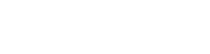
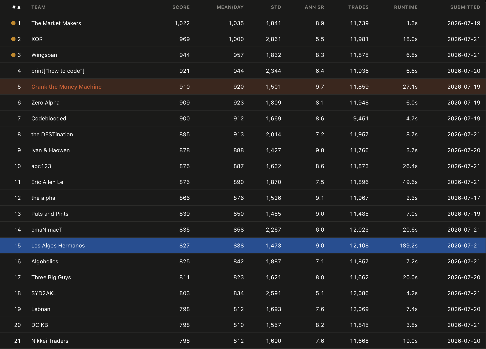

figuring out which pairs / combos of stocks have the most robust relationship, and wont fail in the future. 

Investigate edge behaviours and look for alpha.

Look at lag 1 cross correlations (one day delay). 

Strengthen algorithm by doing regularisation adn making sure its only the last tick not blended. 

The second edge is a pairs edge if you pick the top pairs, they are consistent. However they need to be refitted.

Avoid overfitting - currently the algothon webstie tests data on days 750 - 1000 and you are given data up to day 750. Look for trends.

Highly prioritise consistent returns over volatility.

There isnt really anything very observable in graphs for this thing, the main edge is in very small signatures that u trade a ton of.

Scoring function: 

To know: each submission is evaluated against a growing reservoir of unseen data that increases in size daily.

Some info from top scoring ppl: 

Currently the on-website pnl is still 200ish - lower than the eval.py - so check for overfit or not taking enough of the good pairs. 

Did you find paramters for which the plotted pair of stock is stationary - watch out for there are some thats decreasing after day 750. 